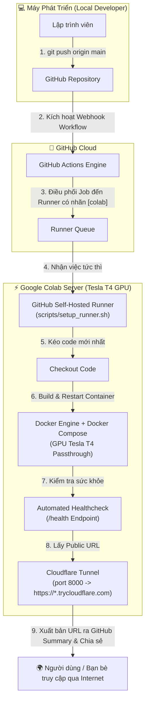

# 🤖 AI Agent Playbook: Quy Trình Triển Khai CI/CD Tự Động Hóa (Cách 2 - Self-Hosted Colab Runner)

Tài liệu này chuẩn hóa toàn bộ **Quy trình Triển khai Tự động (Automated CI/CD Pipeline - Cách 2)** dành cho các **AI Coding Assistant / Agent** (Antigravity, Claude, Cursor, Copilot) hoặc DevOps Engineer.

Mục tiêu cốt lõi: **Zero-Touch Deployment** — Lập trình viên chỉ cần gõ `git push origin main`, toàn bộ quá trình kiểm thử, đóng gói Docker GPU, triển khai trên Google Colab và phát hành đường link công khai (Cloudflare HTTPS) được thực thi hoàn toàn tự động.

---

## 1. Kiến Trúc Tự Động Hóa (System Architecture)



### Ưu điểm vượt trội của Cách 2:
1. **Không cần cấu hình SSH Secrets trên GitHub**: Do Runner chạy **trực tiếp bên trong Colab**, Runner có toàn quyền thực thi lệnh trên máy chủ cục bộ mà không cần lưu khóa riêng tư SSH (`COLAB_SSH_PRIVATE_KEY`) hay VPN token trên GitHub.
2. **Khai thác trực tiếp GPU Tesla T4**: Khối lệnh kiểm thử và container chạy ngay trên phần cứng Colab với CUDA cores và 16GB VRAM.
3. **Phát hành link công khai tự động**: Pipeline tự động đọc hoặc kích hoạt Cloudflare Tunnel và ghi đường dẫn `https://*.trycloudflare.com` trực tiếp vào trang **Job Summary** của GitHub Actions để người dùng bấm vào xem ngay.

---

## 2. Cấu Trúc Thư Mục Chuẩn Cho Mọi Dự Án

Mọi dự án áp dụng quy trình này phải đảm bảo cấu trúc thư mục sau:

```text
<PROJECT_ROOT>/
├── .github/
│   └── workflows/
│       ├── ci.yml                 # Pipeline CI: Kiểm tra cú pháp, Unit Test, Test Docker Build
│       └── cd.yml                 # Pipeline CD: Triển khai tự động lên Colab Runner & cấp Public URL
├── app/ hoặc src/                 # Mã nguồn chính của ứng dụng (FastAPI, Flask, Next.js...)
│   └── ...
├── tests/                         # BẮT BUỘC: Thư mục chứa Unit / Integration Tests
│   └── test_*.py (hoặc *.spec.js, *_test.go)
├── Dockerfile                     # Đóng gói ứng dụng dạng container độc lập
├── docker-compose.yml             # Điều phối ứng dụng & cấu hình GPU Tesla T4
├── requirements.txt               # Danh sách thư viện Python (hoặc package.json)
├── .env.example                   # Biến môi trường mẫu
├── .gitignore                     # Bỏ qua cache, venv, log
└── README.md
```

---

## 3. Quy Chuẩn Các File Cấu Hình (Standardized Templates)

### 3.1. Quy chuẩn `Dockerfile`
- Sử dụng base image nhẹ (`python:3.10-slim` hoặc `nvidia/cuda` nếu biên dịch kernel riêng).
- Phải cài đặt `curl` để hỗ trợ kiểm tra sức khỏe (`HEALTHCHECK`).
- Khai báo đúng cổng phục vụ (`EXPOSE 8000`).

```dockerfile
FROM python:3.10-slim

WORKDIR /app

# Cài đặt curl để phục vụ kiểm tra sức khỏe tự động
RUN apt-get update && apt-get install -y --no-install-recommends curl && rm -rf /var/lib/apt/lists/*

COPY requirements.txt .
RUN pip install --no-cache-dir -r requirements.txt

COPY . .

EXPOSE 8000

# Kiểm tra sức khỏe container định kỳ
HEALTHCHECK --interval=15s --timeout=5s --start-period=5s --retries=3 \
  CMD curl -f http://localhost:8000/health || exit 1

CMD ["uvicorn", "app.main:app", "--host", "0.0.0.0", "--port", "8000"]
```

---

### 3.2. Quy chuẩn `docker-compose.yml` (Hỗ trợ GPU Tesla T4)
Cấu hình Docker Compose phải hỗ trợ chính sách tự khởi động lại và gắn cổng mạng cố định:

```yaml
version: '3.8'

services:
  web_app:
    build:
      context: .
      dockerfile: Dockerfile
    container_name: colab_deployed_app
    restart: unless-stopped
    ports:
      - "8000:8000"
    environment:
      - PORT=8000
      - ENVIRONMENT=staging
    healthcheck:
      test: ["CMD", "curl", "-f", "http://localhost:8000/health"]
      interval: 10s
      timeout: 5s
      retries: 3
    # Mở khóa GPU NVIDIA Tesla T4 cho container (nếu dự án cần AI / PyTorch)
    deploy:
      resources:
        reservations:
          devices:
            - driver: nvidia
              count: all
              capabilities: [gpu]
```

---

### 3.3. Pipeline CI Tự Động (`.github/workflows/ci.yml`)
Kiểm thử mã nguồn trước khi cho phép triển khai:

```yaml
name: CI - Kiểm thử & Đóng gói Tự động

on:
  push:
    branches: [ "main", "develop" ]
  pull_request:
    branches: [ "main" ]

jobs:
  test_and_build:
    name: Run Unit Tests & Build Check
    # Chạy trên chính Colab nếu runner online, hoặc fallback ubuntu-latest
    runs-on: [ self-hosted, colab ]

    steps:
      - name: 1. Checkout Code
        uses: actions/checkout@v4

      - name: 2. Cài đặt thư viện kiểm thử
        run: |
          python3 -m pip install --upgrade pip --break-system-packages 2>/dev/null || true
          pip install --break-system-packages -r requirements.txt pytest httpx

      - name: 3. Thực thi Unit Test
        run: |
          python3 -m pytest -v tests/

      - name: 4. Kiểm tra Build Docker Image
        run: |
          docker build -t app-service:test .
```

---

### 3.4. Pipeline CD Triển Khai Trực Tiếp & Cấp Link Public (`.github/workflows/cd.yml`)
Đây là trái tim của **Cách 2**: Chạy trực tiếp trên `runs-on: [ self-hosted, colab ]`, tự động cập nhật container và xuất link Cloudflare ra GitHub:

```yaml
name: CD - Triển Khai Tự Động Lên Colab Server (Cách 2)

on:
  push:
    branches: [ "main" ]
  workflow_dispatch:

jobs:
  deploy_to_colab:
    name: Zero-Touch Deployment to Colab
    runs-on: [ self-hosted, colab ]

    steps:
      - name: 1. Kéo mã nguồn mới nhất
        uses: actions/checkout@v4

      - name: 2. Đảm bảo Docker Daemon đang hoạt động
        run: |
          if ! docker info > /dev/null 2>&1; then
            echo ">>> Docker daemon chưa bật! Đang kích hoạt containerd & dockerd..."
            nohup containerd > /tmp/containerd.log 2>&1 &
            sleep 2
            nohup dockerd --storage-driver=vfs --iptables=false > /tmp/dockerd.log 2>&1 &
            sleep 4
          fi
          docker info | grep "Server Version"

      - name: 3. Tái khởi động Container Ứng Dụng
        run: |
          echo ">>> Dừng phiên bản container cũ..."
          docker-compose down 2>/dev/null || true
          
          echo ">>> Build và khởi chạy phiên bản mới..."
          docker-compose up -d --build
          
          echo ">>> Danh sách container đang hoạt động:"
          docker ps

      - name: 4. Kiểm tra sức khỏe ứng dụng (Healthcheck)
        run: |
          echo ">>> Chờ ứng dụng khởi động hoàn tất..."
          sleep 6
          
          for i in {1..10}; do
            STATUS=$(curl -s -o /dev/null -w "%{http_code}" http://localhost:8000/health || echo "000")
            if [ "$STATUS" = "200" ]; then
              echo "✅ Ứng dụng đã sẵn sàng trên cổng 8000! (HTTP 200)"
              exit 0
            fi
            echo "⏳ Đang thử lại ($i/10)... Mã HTTP: $STATUS"
            sleep 3
          done
          
          echo "❌ Lỗi: Ứng dụng không phản hồi sau 30 giây!"
          docker-compose logs
          exit 1

      - name: 5. Khởi chạy Cloudflare Public Tunnel & Lấy URL
        id: tunnel
        run: |
          # Cài đặt cloudflared nếu chưa có
          if ! command -v cloudflared &> /dev/null; then
            curl -fsSL https://github.com/cloudflare/cloudflared/releases/latest/download/cloudflared-linux-amd64 -o /usr/local/bin/cloudflared
            chmod +x /usr/local/bin/cloudflared
          fi

          # Kiểm tra nếu tunnel đã chạy thì dùng lại, nếu chưa thì bật mới
          if ! pgrep -x cloudflared > /dev/null; then
            echo ">>> Khởi chạy Cloudflare Tunnel mới..."
            nohup cloudflared tunnel --url http://127.0.0.1:8000 > /tmp/cf_tunnel.log 2>&1 < /dev/null &
            sleep 5
          fi

          # Trích xuất đường link HTTPS công khai
          PUBLIC_URL=$(grep -o 'https://[a-zA-Z0-9-]*\.trycloudflare\.com' /tmp/cf_tunnel.log | head -n 1 || echo "")
          
          if [ -z "$PUBLIC_URL" ]; then
            # Thử lấy lại từ log hiện hành
            sleep 2
            PUBLIC_URL=$(grep -o 'https://[a-zA-Z0-9-]*\.trycloudflare\.com' /tmp/cf_tunnel.log | tail -n 1 || echo "")
          fi

          echo "PUBLIC_URL=$PUBLIC_URL" >> $GITHUB_ENV
          echo "URL_FOUND=$PUBLIC_URL"

      - name: 6. Xuất bản Thông Báo & Link Ra GitHub Summary
        run: |
          echo "## 🚀 Triển Khai Lên Colab Server Thành Công!" >> $GITHUB_STEP_SUMMARY
          echo "" >> $GITHUB_STEP_SUMMARY
          echo "| Thuộc tính | Giá trị |" >> $GITHUB_STEP_SUMMARY
          echo "| :--- | :--- |" >> $GITHUB_STEP_SUMMARY
          echo "| **Trạng thái** | 🟢 Online (Healthy) |" >> $GITHUB_STEP_SUMMARY
          echo "| **Máy chủ** | Google Colab (Tesla T4 GPU) |" >> $GITHUB_STEP_SUMMARY
          echo "| **Cổng dịch vụ** | \`8000\` |" >> $GITHUB_STEP_SUMMARY
          echo "| **Link Nội bộ (Tailscale)** | \`http://colab-server:8000\` |" >> $GITHUB_STEP_SUMMARY
          if [ -n "$PUBLIC_URL" ]; then
            echo "| **Link Công khai (Public)** | [👉 BẤM VÀO ĐÂY ĐỂ MỞ ỨNG DỤNG]($PUBLIC_URL) |" >> $GITHUB_STEP_SUMMARY
            echo "" >> $GITHUB_STEP_SUMMARY
            echo "> 🌐 **Đường link công khai để chia sẻ cho mọi người:** \`$PUBLIC_URL\`" >> $GITHUB_STEP_SUMMARY
          else
            echo "| **Link Công khai (Public)** | Đang khởi tạo... Xem tại \`/tmp/cf_tunnel.log\` trên Colab |" >> $GITHUB_STEP_SUMMARY
          fi
```

---

## 4. Hướng Dẫn Cấu Hình 1 Lần Duy Nhất (One-Time Setup)

Để kích hoạt **Cách 2**, lập trình viên chỉ cần thao tác 2 bước cực kỳ đơn giản:

### Bước 1: Lấy Runner Token trên GitHub Repository
1. Vào repository trên GitHub > Chọn **Settings** > **Actions** > **Runners**.
2. Bấm nút **New self-hosted runner**.
3. Chọn hệ điều hành **Linux** $\rightarrow$ Kéo xuống cuối phần lệnh cấu hình, copy chuỗi mã sau `--token` (đây là `RUNNER_TOKEN`).

### Bước 2: Điền Token Vào Sổ Tay Colab
1. Mở file [colab_server.ipynb](file:///home/giangpv102/Tool/Colab2Server/colab_server.ipynb) trên Google Colab.
2. Tại **Bước 3 (Bảng Cấu Hình)**:
   - Tích chọn: `ENABLE_RUNNER = True`
   - Dán token vừa copy vào: `RUNNER_TOKEN = "MÃ_TOKEN_VỪA_LẤY"`
   - Đặt nhãn: `RUNNER_LABELS = "colab,gpu,cuda,staging"`
3. Nhấn **Run All (Chạy tất cả)**: Runner sẽ tự động đăng ký với GitHub và chuyển sang trạng thái **Idle (Sẵn sàng nhận lệnh)**.

> [!NOTE]
> Bạn **KHÔNG CẦN** cấu hình thêm SSH Key hay Tailscale Authkey trong mục GitHub Secrets, vì GitHub Actions sẽ gửi lệnh trực tiếp vào Runner nằm sẵn trong Colab.

---

## 5. Quy Trình Vận Hành Hàng Ngày Dành Cho Lập Trình Viên

Sau khi đã thiết lập xong, mỗi ngày khi làm việc:

1. **Khởi động Colab**: Mở notebook Colab và bấm nút chạy (chỉ mất ~1 phút).
2. **Viết code tại máy tính cá nhân**: Sửa đổi tính năng, fix bug tại local repository.
3. **Đẩy code lên GitHub**:
   ```bash
   git add .
   git commit -m "feat: cập nhật chức năng mới"
   git push origin main
   ```
4. **Nhận kết quả**:
   - Mở tab **Actions** trên GitHub repository.
   - Nhìn vào bảng **Job Summary**: Click trực tiếp vào đường link `https://*.trycloudflare.com` được tạo tự động để xem hoặc gửi cho người khác test.

---

## 6. Bảng Xử Lý Sự Cố Cho Agent & Developer (Troubleshooting Matrix)

| Vấn đề | Nguyên nhân | Cách khắc phục tự động |
| :--- | :--- | :--- |
| **Workflow báo: `Waiting for a runner with labels [self-hosted, colab]`** | Phiên Colab bị ngắt hoặc bạn chưa chạy cell kích hoạt Runner. | Mở lại notebook `colab_server.ipynb`, kiểm tra token và bấm chạy lại Cell 4 (`setup_runner.sh`). |
| **Lỗi `Cannot connect to the Docker daemon`** | Docker Engine trong Colab bị dừng khi ngủ đông. | Workflow CD ở trên đã tích hợp sẵn đoạn mã tự kích hoạt `dockerd` với driver `vfs` trước khi deploy. |
| **Healthcheck thất bại (HTTP 000 / 500)** | Container bị crash do thiếu biến môi trường hoặc cổng ứng dụng không phải `8000`. | Đổi cổng ứng dụng trong Dockerfile thành `0.0.0.0:8000` và kiểm tra lại log container bằng `docker-compose logs`. |
| **Không hiển thị link Cloudflare trong Summary** | `cloudflared` chưa kịp đồng bộ với CDN Cloudflare trong 5 giây đầu. | Đăng nhập SSH vào Colab gõ `cat /tmp/cf_tunnel.log` để lấy link mới nhất, hoặc kéo lại workflow CD sau 10 giây. |
